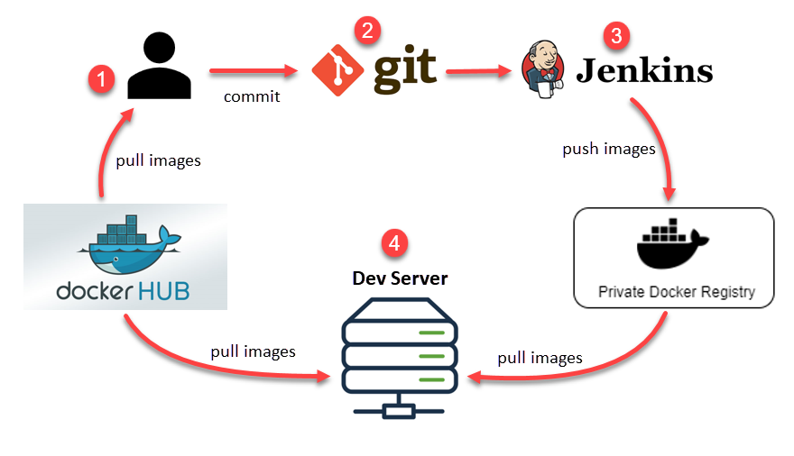

# Docker 基礎概念

## 什麼是容器？ 

容器是一種打包 app 的方式。透過容器管理工具（例如 Docker）來把 app 及其所需的相關檔案全包在一個特殊格式的檔案裡，而這個檔案就是所謂的容器影像檔（container image）。

## 容器放在哪裡？ 

打包成容器格式的檔案會放在容器的儲存庫（container repository）。

容器儲存庫可以是完全公開的，例如 Docker Hub，也可以是公司內部建立的私有儲存庫。

## 容器有何優點？ 

下圖描繪了 Docker 容器運用於軟體開發流程的一種作法：

<figure><figcaption></figcaption></figure>
